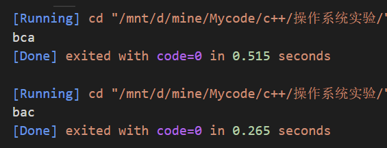
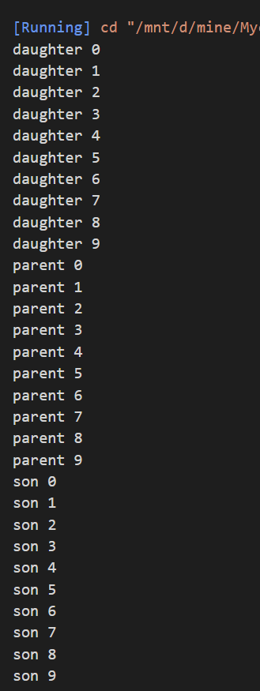
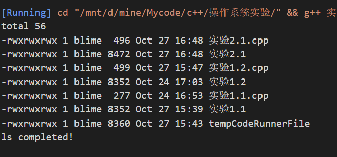

```c++
// 实验1.1
#include<stdio.h>
#include<unistd.h>
using namespace std;
int main(){
    pid_t p1,p2;
    // p1 = fork();
    while((p1=fork())==-1);
    if(p1==0) putchar('b');
    else {
        while((p2=fork())==-1);
        if(p2==0) putchar('c');
        else putchar('a');
    }
    
}
```



```c++
// 实验1.2
#include<stdio.h>
#include<unistd.h>
using namespace std;

int main(){
    pid_t p1,p2,i;
    while((p1=fork())==-1);
    if(p1==0){
        for(i=0;i<10;i++){
            printf("daughter %d\n",i);
        }
    }
    else{
        while((p2=fork())==-1);
        if(p2==0){
            for(i=0;i<10;i++){
                printf("son %d\n",i);
            }
        }
        else{
            for(i=0; i<10;i++){
                printf("parent %d\n",i);
            }
        }
    }
}
```



```c++
//实验2.1
#include<stdio.h>
#include<unistd.h>
#include<cstdlib>
#include<sys/types.h>
#include<sys/wait.h>

using namespace std;
int main()
{
    pid_t pid;
    pid =fork();
    switch (pid){
        case -1:
            printf("fork failed!\n");
            exit(1);
        case 0:
            execl("/bin/ls","ls","-l","-color",NULL);
            printf("exec failed!\n");
            exit(1);
        default:
            wait(NULL);
            printf("ls completed!\n");
            exit(0);
    }
}
```



