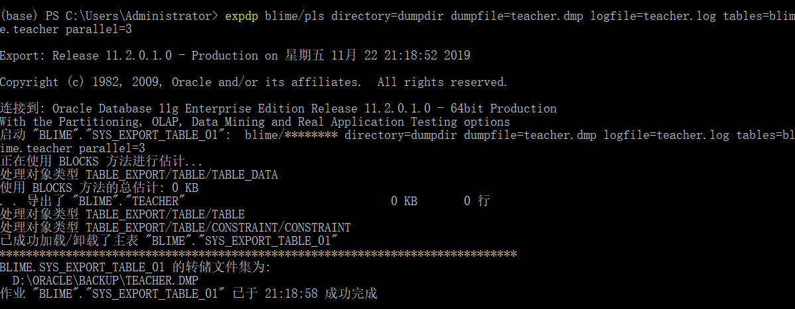

1.  在数据库中创建 DIRECTORY 对象，并将该对象的 READ、WRITE 权限授予用户 （用户需要先创建）。 

  CREATE OR REPLACE DIRECTORY dumpdir AS 'D:\ORACLE\BACKUP'; GRANT READ,WRITE ON DIRECTORY dumpdir TO ehr; 

  ```sql
  CREATE OR REPLACE DIRECTORY dumpdir AS 'D:\ORACLE\BACKUP';--这里需要自己创建D:\ORACLE\BACKUP文件加，因为Oracle自是做了映射，不会创建目录，如果本来没有目录后面的expdp，impdp操作将失败。
  GRANT READ,WRITE ON DIRECTORY dumpdir TO blime; 
  ```

  

2.  导出或导入非同名模式的对象，赋予用户 EXP_FULL_DATABASE 和 IMP_FULL_DATABASE 权限 
  GRANT EXP_FULL_DATABASE, IMP_FULL_DATABASE TO ehr; 

  ```sql
  GRANT EXP_FULL_DATABASE, IMP_FULL_DATABASE TO blime; 
  ```

3.  在控制台 cmd 命令行下，执行 expdp help=y 和 impdp help=y，熟悉 expdp 和 impdp 命令的使用方法； 

   cmd

   ```
    expdp help=y
    impdp help=y
   ```

   

4.  利用 EXPDP 导出数据 

   （1）导出 Teacher 表 

   ```
   expdp blime/pls directory=dumpdir dumpfile=teacher.dmp logfile=teacher.log tables=blime.teacher parallel=3
   ```

   

   

   （2）导出 Teacher 所在的模式 

   ```
   expdp blime/pls directory=dumpdir dumpfile=schemas.dmp schemas=blime
   ```

   

   

   （3）全库导出 

   ```sql
   expdp scott/pls@orcl DIRECTORY=dumpdir DUMPFILE=full.dmp FULL=y;
   ```

   


5. 利用 IMPDP 导入数据 

   （1）导入 Teacher 表中的数据 

   模拟误删表中数据：

   ```sql
   truncate table teacher;
   ```

   导入 Teacher 表中的数据:

   ```
   impdp blime/pls directory=dumpdir dumpfile=teacher.dmp tables=teacher content=DATA_ONLY
   ```

   

   模拟误删了表：

   ```sql
   drop table teacher;
   ```

   导入 Teacher 表：

   ```sql
   impdp blime/pls directory=dumpdir dumpfile=teacher.dmp tables=teacher nologfile=Y
   ```

   （2）导入模式 

   ```
   impdp blime/pls directory=dumpdir dumpfile=schemas.dmp schemas=blime
   ```

   

   （3）导入数据库 

   ```
   impdp blime/pls directory=dumpdir dumpfile=full.dmp full=yes nologfile=yes
   ```

   

   

6.  在 SQLPLUS 命令符下，执行 set time on，然后设计数据，体验 Oracle 闪回查询 的基本功能。

    设计数据：

    ```sql
    drop table teacher;
    drop table department;
    
    create table department(
      dno VARCHAR2(10) primary key,
      dname varchar2(20)
    );
    
    create table teacher(
      TNO                  VARCHAR2(20)         not null,
      DNO                  VARCHAR2(10)         not null,
      TName                NVARCHAR2(20)        not null,
      TSex                 VARCHAR2(3)          not null,
      TSalary              NUMBER(30,2),
      projectFunds         NUMBER(10,2),
      workdays             INTEGER,
      constraint PK_TEACHER primary key (TNO),
      constraint F_TEACHER foreign key (dno)references department(dno)
    );
    
    insert into department(dno,dname)values('d001','计算机科学系');
    insert into department(dno,dname)values('d002','软件工程系');
    insert into department(dno,dname)values('d003','数学系');
    
    insert into teacher(tno, tname, tsex, tsalary, dno,projectFunds,workdays) values('t001', '张三', '男', 3000,'d001',100000,1000);
    insert into teacher(tno, tname, tsex,  tsalary, dno, projectFunds,workdays) values('t002', '李四', '女', 3600,'d001',50000,1200);
    insert into teacher(tno, tname, tsex,  tsalary, dno, projectFunds,workdays) values('t003', '王五', '女', 5600,'d002',80000,365);
    insert into teacher(tno, tname, tsex,  tsalary, dno, projectFunds,workdays) values('t004', '刘晨', '女', 5800, 'd002',60000,365);
    insert into teacher(tno, tname, tsex,  tsalary, dno, workdays) values('t005', '王二小', '男', 3500,'d003',600);
    insert into teacher(tno, tname, tsex,  tsalary, dno, workdays) values('t006', '李小龙', '男', 5687, 'd003',1100);
    insert into teacher(tno, tname, tsex,  tsalary, dno, workdays) values('t007', '熊猫', '男', 6000, 'd003',200);
    insert into teacher(tno, tname, tsex,  tsalary, dno, projectFunds,workdays) values('t008', '李小小', '女', 5687, 'd001',30000,365);
    commit ;
    select *from department;
    select *from teacher;
    ```

    Oracle 闪回查询 的基本功能:

    ```sql
    set timing on;
    ```

    ```sql
    select current_scn from V$DATABASE;  --2188750   2019-11-23 22:39:13
    delete teacher where TNO='t008';
    commit ;
    select * from teacher;
    select CURRENT_SCN from V$DATABASE;  --2189102
    update teacher set projectFunds=12345 where tno='t001';
    commit ;
    select * from teacher;
    select * from teacher as of scn 2188750;
    select * from teacher as of scn 2189102;
    select * from teacher as of timestamp to_timestamp('2019-11-23 22:39:13','YYYY-MM-DD HH24:MI:SS');--闪回查询基于时间
    ```

    

7.  按步骤执行代码，体验 Oracle 闪回表操作。 

    （1）启动“回收站”： 

    SQL>SHOW PARAMETER RECYCLEBIN  

    SQL>ALTER SYSTEM SET RECYCLEBIN=ON; 

    启动“回收站”： 

    ```
    SQL>SHOW PARAMETER RECYCLEBIN  
    SQL>alter system set recyclebin=on deferred;
    ```

    

    （2）查看“回收站”： 

    SQL>DROP TABLE test; 

    SQL>SELECT OBJECT_NAME,ORIGINAL_NAME,TYPE FROM USER_RECYCLEBIN; 

    OBJECT_NAME：删除对象在回收站中的名字，唯一； 

    ORIGINAL_NAME：对象删除前的名字； 

    查看“回收站”：

    ```sql
    --因为回收站里有东西，不方便查看学习，所以先清空了回收站
    --在blime用户进行
    purge recyclebin; 		--清空回收站
    create table test(tno int primary key);
    insert into test(tno) values (1);
    commit;
    drop table test;
    SELECT OBJECT_NAME,ORIGINAL_NAME,TYPE FROM USER_RECYCLEBIN; 
    ```

    

    （3）闪回删除： 

    SQL>CREATE TABLE example(ID NUMBER PRIMARY KEY, NAME CHAR(20)); 

    SQL>INSERT INTO example VALUES(1,'BEFORE DROP'); 

    SQL>COMMIT;

    SQL>DROP TABLE example; 

    SQL>FLASHBACK TABLE example TO BEFORE DROP RENAME TO new_example; 

    SQL>SELECT * FROM new_example; 

    ```sql
    --完全照打就好了
    CREATE TABLE example(ID NUMBER PRIMARY KEY, NAME CHAR(20)); 
    INSERT INTO example VALUES(1,'BEFORE DROP'); 
    COMMIT;
    DROP TABLE example; 
    FLASHBACK TABLE example TO BEFORE DROP RENAME TO new_example; 
    SELECT * FROM new_example; 
    ```

    
