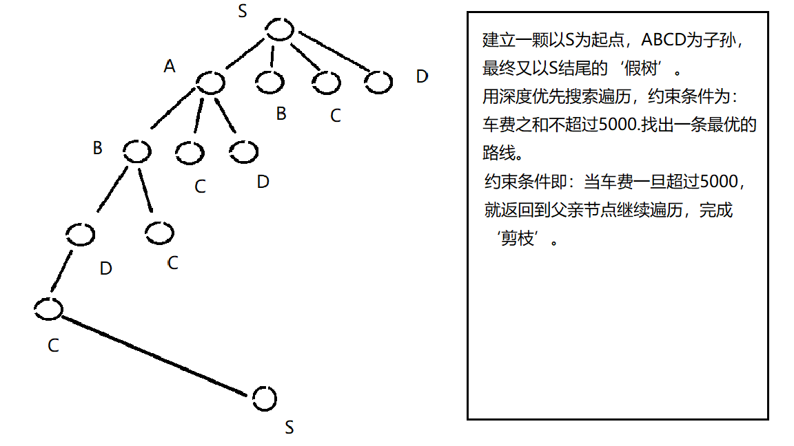

#### **潘乐诗	软件172	1706300077**

#### **谢绍波	计科173	1706100109**


# 行程安排

[TOC]

 

## 1. 问题描述

国庆期间，住在广州的小明同学打算去旅游，想请你帮忙规划一条好的旅游路线，已知小明想去上海，北京，武汉，西安，四个城市旅游，有5000元预算，打算旅游7天。


## 2. 为问题提出模型

将整个问题分为**去这四个城市的最省钱的路径问题**，和**在四个城市中游玩的景点规划安排问题**。

为了使问题不过于复杂，**我们提出以下模型和假设**：

给出一个5个结点的完全图G=(V,E),V={S,A,B,C,D},对应5个城市：广州，上海，北京，武汉，西安，定义图中节点的边为城市到城市的车费。（即，边SA，表示，从广州到上海的车费）

减去总车费，剩余的钱用于每个城市的景点游玩，

让小明自行安排每个城市使用的钱，Vi（i=0,1,2,3)。（即V0表示在上海景点游玩的钱。）假设只考虑每个城市的N个（6<N<12)著名景点，每个景点花费Wi元，每个景点能让小明获得Vi点的快乐值。我们要找出能让在不超过$$M_i$$元的，让小明最快乐的景点规划路线。


## 3. 针对提出模型的算法

### 3.1 **去这四个城市的最省钱的路径问题**（TSP问题）

#### a. 穷举法

​		对ABCD四个城市全排列，得到SABCDS,SABDCS,SACBDS,.....SDCBAS等24种组合，求出每种组合的费用，选择最省钱的路径。由于本次城市较少，直接穷举也不用太多时间，也没有什么问题。

​		穷举法的不足：例如SABC已经是超过5000元了，就没有必要继续算，SABCDS了，所以为了避免没有必要的穷举，我们使用树状剪枝法

#### b. 树状剪枝法(dfs)

​				

​		

### 3.2 **在四个城市中游玩的景点规划安排问题**（背包问题）

#### 	a. 01背包

>通俗易懂的解释：就是一个取舍问题，即对第i个景点的取舍问题。如果选择去，就意味着要花掉一定的钱，来获得一定的快乐，我们要做的就是，找出在有限的钱中，找出最快乐的取舍组合。
>
>下面将用抽象的符号来表示上面的解释：
>
>fun[i\][money]=max{fun[i-1\][money],fun[i-1\][money-need[i]]+happy[i]}
>
>其中
>
>fun[i\][money]:表示前i城市，最佳选择获得的最大快乐值。
>
>fun[i-1\][money-need]+happy：表示，选择去第i个城市后，减去去第i个城市所需要的费用，然后获得的快乐值。
>
>不难发现，这是一个递归.
>
> 先考虑上面讲的基本思路如何实现，肯定是有一个主循环i=1..N，每次算出来二维数组fun[i\][0..Money]的所有值.接着在每次主循环中我们以money=Money..0的顺序推fun[v]，这样才能保证推fun[money]时fun[money-need[i]]保存的是状态fun[i-1\][money-need[i]]的值。

>伪代码如下：
>
>```c++
>for i=1...N
>    for money=Money...0
>        fun[money]=max{fun[money],fun[money-need[i]]+happy[i]}
>```
>
>01背包就像是用数组按顺序的选择是否去一个城市，两个for循环找出在剩余多少钱之下，最开心的组合。

#### b. dfs

>对于每个城市，有两种情况（去，或不去）。若选择去该城市，则将更新总花费与总快乐值，若不去该城市，则跳过它去判断下一个城市，当处理完n个城市后，此时记录的sum_need和sum_happy就是所选城市的总花销和总快乐值。如果sum_need不超过Money且sum_happy比Max_happy还大，就更新Max_happy。

> 相关代码如下：
>
> ```c++
> void dfs(int index, int sum_need,int sum_happy){
>     if(sum_need>Money){             //当所需要的钱超过能在该城市花销的钱，
>         index=n;                    //直接跳出dfs，
>         sum_happy=-1;               //变得不再快乐。
>     }
>     if(index==n){
>         if(sum_happy > Max_happy){  //发现了更加快乐的选择
>             Max_happy=sum_happy;    //更新最大快乐值
>         }
>         return ;
>     }
>     dfs(index+1,sum_need,sum_happy);
>     dfs(index+1,sum_need+need[index],sum_happy+happy[index]);
>     
> }
> ```
>
> 


