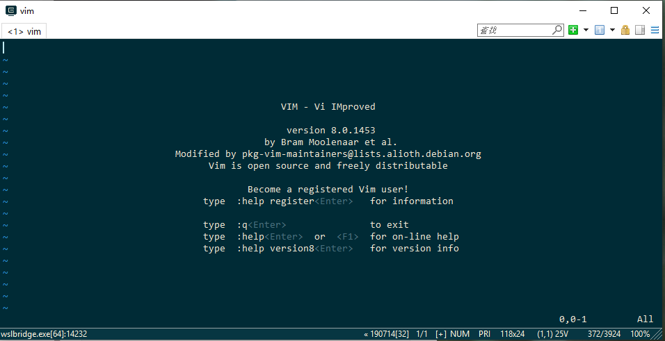
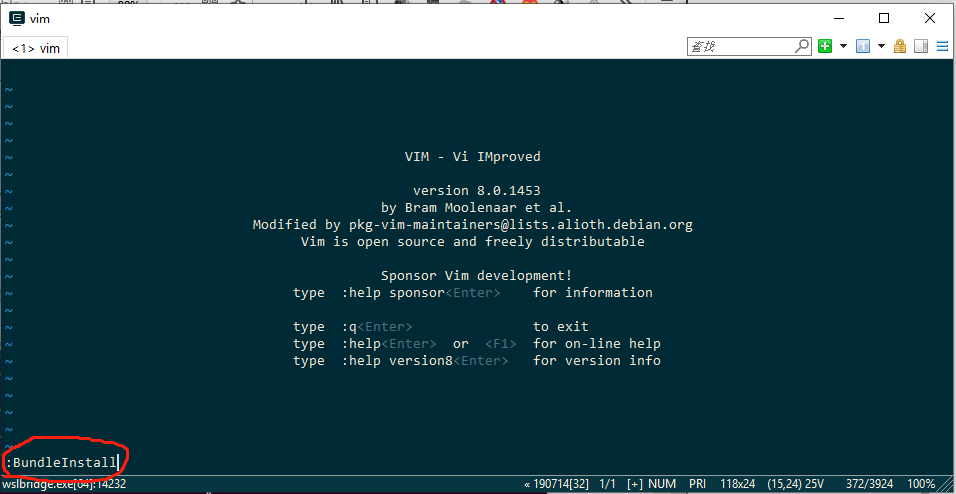
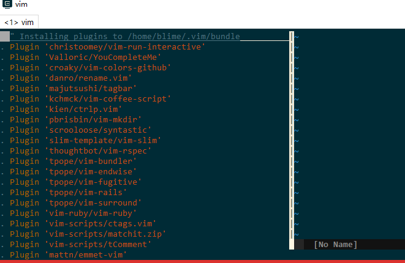
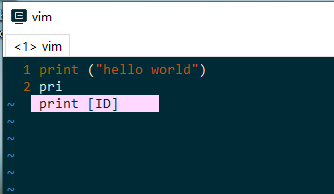
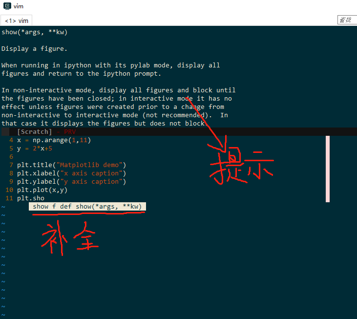

# ubuntu vim插件

[参考链接](https://blog.csdn.net/lu_embedded/article/details/76732965)

[TOC]

简述过程：

## 1. 安装vim

```
sudo apt-get install vim
```


## 2. 安装Vundle

```
git clone https://github.com/gmarik/vundle.git ~/.vim/bundle/vundle
```

> 新建了一个 **~/.vimrc.bundles** 文件来保存所有插件的配置。

```
sudo vim ~/.vimrc.bundles
```

> 在里面写入👇

```
filetype off
  set rtp+=~/.vim/bundle/vundle/
call vundle#rc()
```

> wq! 保存

> **~/.vimrc** 文件中加入内容：

```
sudo vim ~/.vimrc
```

```
if filereadable(expand("~/.vimrc.bundles"))
  source ~/.vimrc.bundles
endif
```


## 3.安装插件

在 ~/.vimrc.bundles中写入👇

```
sudo vim  ~/.vimrc.bundles
```

```
" Define bundles via Github repos "
Bundle 'christoomey/vim-run-interactive'
Bundle 'Valloric/YouCompleteMe'
Bundle 'croaky/vim-colors-github'
Bundle 'danro/rename.vim'
Bundle 'majutsushi/tagbar'
Bundle 'kchmck/vim-coffee-script'
Bundle 'kien/ctrlp.vim'
Bundle 'pbrisbin/vim-mkdir'
Bundle 'scrooloose/syntastic'
Bundle 'slim-template/vim-slim'
Bundle 'thoughtbot/vim-rspec'
Bundle 'tpope/vim-bundler'
Bundle 'tpope/vim-endwise'
Bundle 'tpope/vim-fugitive'
Bundle 'tpope/vim-rails'
Bundle 'tpope/vim-surround'
Bundle 'vim-ruby/vim-ruby'
Bundle 'vim-scripts/ctags.vim'
Bundle 'vim-scripts/matchit.zip'
Bundle 'vim-scripts/tComment'
Bundle 'mattn/emmet-vim'
Bundle 'scrooloose/nerdtree'
Bundle 'Lokaltog/vim-powerline'
Bundle 'godlygeek/tabular'
Bundle 'msanders/snipmate.vim'
Bundle 'jelera/vim-javascript-syntax'
Bundle 'altercation/vim-colors-solarized'
Bundle 'othree/html5.vim'
Bundle 'xsbeats/vim-blade'
Bundle 'Raimondi/delimitMate'
Bundle 'groenewege/vim-less'
Bundle 'evanmiller/nginx-vim-syntax'
Bundle 'Lokaltog/vim-easymotion'
Bundle 'tomasr/molokai'
Bundle 'klen/python-mode'
```

### 打开 vim，输入 `:BundleInstall`

(怕你出错，我截图一下：👇)

#### 在命令行输入vim，进入这个界面

```
vim
```



#### 和输入wq!,一样，输入 `:BundleInstall`



#### 然后等它安装，要下载安装有点长时间，慢慢等吧




> ! Plugin 'evanmiller/nginx-vim-syntax' 我的这个插件安装失败了，你可以直接不安装它，应该也还用不到


看到，done 就安装完成了。

:q! 退出就好了


## 4.试一试自动补全吧





## 5.一些报错

[vim之YouCompleteMe插件问题：The ycmd server SHUT DOWN (restart with ...low the instructions in the documen](https://blog.csdn.net/qq_37373203/article/details/84643395)

其他报错，忽视吧，🤦‍