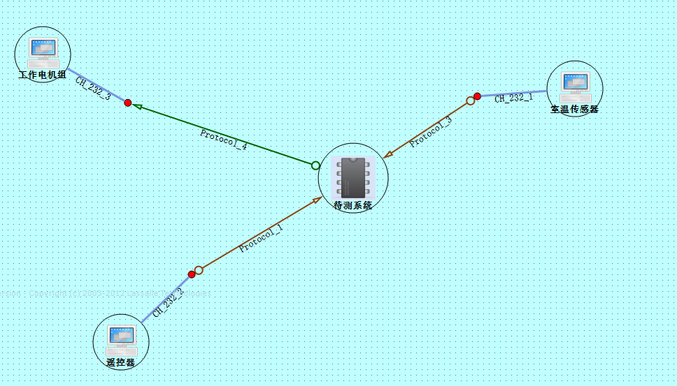
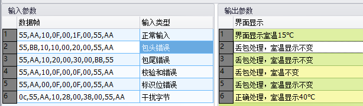
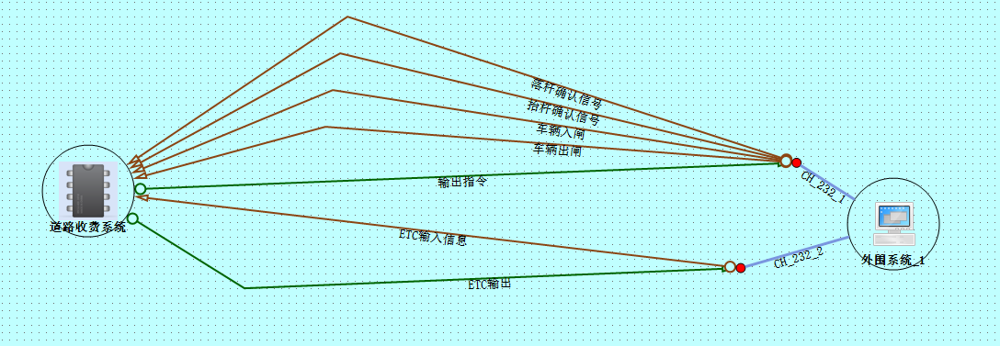

# 嵌入式笔记

[TOC]


## 空调待测件

### 温度设置

| 设置温度      | 序号        | 界面显示温度  |
| ------------- | ----------- | ------------- |
| System.UInt16 | System.Byte | System.UInt16 |
| 25            | 1           | 25            |
| 15            | 2           | 16            |
| 30            | 3           | 30            |
| 31            | 4           | 30            |

```python
import Manu
############标准测试模板#######################
## Test:测试数据执行函数体，【测试数据】每一行数据调用一次Test
## arg:输入参数
## exp：预期输出
def Test(arg,exp):
  print '测试用例%d：命令设定温度值为%d' % (arg[1],arg[0])
  Protocol_1.Tmp.Value=arg[0]		#向协议中写数据
  Protocol_1.Write()				#协议写
  API.Common.Timer.Normal.Sleep(1000)

  show=[]
  str = '遥控器设定温度为:%d,界面预期显示为:%d' % (arg[0],exp[0])
  show.append(str)
  show.append('界面室温显示是否正确?')
  passed=Manu.Check(show)

  if(passed):
      print '界面显示与预期一致,界面判断通过'
  else:
      print '界面显示与预期不一致,界面判断不通过'

  ## 断言:根据实际需求修改一下注释的部分 
  #assertor=API.Platform.Assertion.Create()
  #assertor.AddInput('命令设置温度',arg[0])
  #assertor.AddOutput('界面显示温度',exp[0],passed)

  if (arg[0]<16 and exp[0]==16 and passed) or (arg[0]>30 and exp[0]==30 and passed) or (16<=arg[0]<=30 and exp[0]==arg[0] and passed) :#测试通过
    print '本次测试通过。'
    #assertor.Pass()
  else:
    print '本次测试不通过，请输入测试问题'
    #assertor.Failed()
  #b=assertor.Commit()
  CH_232_2.Clear()

## Standard_Test:标准测试的方法入口，使用【测试数据】表循环调用Test方法
Standard_Test(Test)
```


### 故障功能警告

```python
#测试 室温采集故障告警（SWCJGZ_GN）;先启动软件脚本，然后打开被测件
#传感器一直采集发送室温，观察界面是否还出现“传感器故障”信息——“传感器故障”信息一直存在。
E = [-13,-12,-11,-10,-9,-8,-7,10,38,39,40,41,42]
for i in range(0,5):
  for a in E:
    Protocol_3.当前室温.Value=a
    Protocol_3.Write()
    API.Common.Timer.Normal.Sleep(500)
    print a
  if (i==2):
    print '测试5秒没有传感器温度，不显示报警标识'
    API.Common.Timer.Normal.Sleep(5000)
  if (i==3):
    print '测试6秒没有传感器温度，显示报警标识'
    API.Common.Timer.Normal.Sleep(6000)
  if (i==4):
    print '测试4秒没有传感器温度,报警标准不再显示'
    API.Common.Timer.Normal.Sleep(4000)
```


### 室温采集与处理

| 当前室温1    | 当前室温2    | 当前室温3    | 序号        | 数据情况      | 输出室温     |
| ------------ | ------------ | ------------ | ----------- | ------------- | ------------ |
| System.Int16 | System.Int16 | System.Int16 | System.Byte | System.String | System.Int16 |
| -11          | -11          | -11          | 1           | 超出下边界    | -10          |
| 26           | 32           | 34           | 2           | 小数部分>0.5  | 31           |
| 33           | 45           | 37           | 3           | 小数部分<0.5  | 38           |
| 41           | 41           | 41           | 4           | 超出上边界    | 40           |
| 40           | 40           | 40           | 5           | 上边界值      | 40           |
| -10          | -10          | -10          | 6           | 下边界值      | -10          |

```python
import Manu
import math
############标准测试模板#######################
## Test:测试数据执行函数体，【测试数据】每一行数据调用一次Test
## arg:输入参数
## exp：预期输出

def Test(arg,exp):
  seekresult=CH_232_1.Clear()			#清空信道
  print '测试用例%d'%arg[3]

  Protocol_3.当前室温.Value=arg[0]
  Protocol_3.Write()
  API.Common.Timer.Normal.Sleep(500)
  
  Protocol_3.当前室温.Value=arg[1]
  Protocol_3.Write()
  API.Common.Timer.Normal.Sleep(500)

  Protocol_3.当前室温.Value=arg[2]
  Protocol_3.Write()
  API.Common.Timer.Normal.Sleep(500)

  show=[]
  str = '室温预期显示为:%d' % (exp[0])
  show.append(str)
  str = '界面室温显示是否正确?'
  show.append(str)
  passed=Manu.Check(show)

  if(passed):
      print '界面显示与预期一致,界面判断通过'
  else:
      print '界面显示与预期不一致,界面判断不通过'

  ## 断言:根据实际需求修改一下注释的部分 
  assertor=API.Platform.Assertion.Create()
  assertor.AddInput('设置室内温度',arg[2])
  assertor.AddOutput('采集显示温度',exp[0],passed) 

  if (passed):#测试通过   
    print '本次测试通过。'
    assertor.Pass()
  else:
    print '本次测试不通过，请输入测试问题'
    assertor.Failed()
  b=assertor.Commit()


## Standard_Test:标准测试的方法入口，使用【测试数据】表循环调用Test方法
Standard_Test(Test)
#############################################
```


### 控温自动调节

| 当前室温     | 设置温度      | 序号        | 运转状态    | 是否发送指令     |
| ------------ | ------------- | ----------- | ----------- | ---------------- |
| System.Int16 | System.UInt16 | System.Byte | System.Byte | System.String    |
| 25           | 25            | 1           | 1           | 不发送指令       |
| 24           | 25            | 2           | 1           | 不发送指令       |
| 23           | 25            | 3           | 0           | 发送停止运转指令 |
| 22           | 25            | 4           | 0           | 发送停止运转指令 |
| 1            | 25            | 5           | 0           | 不发送指令       |
| 26           | 26            | 6           | 1           | 发送运转指令     |

```python
import Manu
############标准测试模板#######################
## Test:测试数据执行函数体，【测试数据】每一行数据调用一次Test
## arg:输入参数
## exp：预期输出


def Test(arg,exp):
  CH_232_2.Clear()
  CH_232_3.Clear()
  CH_232_1.Clear()
  print '测试用例%d'%arg[2]

  if arg[0]==0: #设置停止7秒
    API.Common.Timer.Normal.Sleep(7000)
  else:
    Protocol_3.当前室温.Value=arg[0]
    Protocol_3.Write()
    API.Common.Timer.Normal.Sleep(500)
  
    Protocol_3.当前室温.Value=arg[0]
    Protocol_3.Write()
    API.Common.Timer.Normal.Sleep(500)
    
    Protocol_3.当前室温.Value=arg[0]
    Protocol_3.Write()
    
  Protocol_1.Tmp.Value=arg[1]
  Protocol_1.Write()
#  API.Common.Timer.Normal.Sleep(500)
  Protocol_4.Read()

  b = Protocol_4.运转状态.Value
  if arg[0]==0: 
    str='*当前室温故障*'
  else:
    str = arg[0]
  print '设定温度为%d,当前室温为%s,预期运转状态%d,输出运转状态%d'%(arg[1],str,exp[0],b)
  show=[]
  str = '设定温度为：%d' % (arg[1])
  show.append(str)
  if arg[0]==0: 
    str='当前室温故障'
  else:
    str = '当前室温为：%d' % (arg[0])
  show.append(str)
  str = '请确认：%s' % (exp[1])
  show.append(str)
  passed=Manu.Check(show)
  
  if(passed):
      print '界面判断通过'
  else:
      print '界面判断不通过'

  ## 断言:根据实际需求修改一下注释的部分 
  assertor=API.Platform.Assertion.Create()
  assertor.AddInput('当前温度',arg[0])
  assertor.AddOutput('运转状态',exp[0],exp[0])
  assertor.AddOutput('是否发送指令',exp[1],passed) 

  if passed:#测试通过
    print '本次测试通过。'
    assertor.Pass()
  else:
    print '本次测试不通过，请输入测试问题'
    assertor.Failed()
  b=assertor.Commit()

  API.Common.Timer.Normal.Sleep(1000) 

## Standard_Test:标准测试的方法入口，使用【测试数据】表循环调用Test方法
Standard_Test(Test)
#############################################

```


### 接口1

| 数据帧                                         | 输入类型       | 界面显示                        |
| ---------------------------------------------- | -------------- | ------------------------------- |
| System.String                                  | System.String  | System.String                   |
| 55，AA，00，20，00，1E，00，3E，00，55，AA     | 正常输入       | 界面设置温度显示为30℃           |
| 55，AA，00，20，00，14，00，34，00，55，BB     | 包尾错误       | 丢包处理，界面设置温度不变      |
| 66，CC，00，20，00，16，00，36，00，CC，66     | 包头和包尾错误 | 丢包处理，界面设置温度不变      |
| 55，AA，01，20，00，18，00，38，00，55，AA     | 标识位错误     | 丢包处理，界面设置温度不变      |
| 55，AA，00，21，00，1A，00，3B，00，55，AA     | 命令标识位错误 | 丢包处理，界面设置温度不变      |
| 55，AA，00，20，00，1B，00，3F，00，55，AA     | 校验和错误     | 丢包处理，界面设置温度不变      |
| 0C，55，AA，00，20，00，1D，00，3D，00，55，AA | 干扰字节输入   | 取出正确数据帧，温度应显示为29℃ |
| 55，BB，00，20，00，12，00，32，00，55，AA     | 包头错误       | 丢包处理，界面设置温度不变      |

```python
import Manu
############标准测试模板#######################
## Test:测试数据执行函数体，【测试数据】每一行数据调用一次Test
## arg:输入参数
## exp：预期输出
def Test(arg,exp):
  datas=arg[0].split('，')
  l=[]
  for a in datas:
    l.append(int(a,16))
  CH_232_2.Clear()
  CH_232_2.Write(l)
  
  show=[]      
  str='输入：%s'%(arg[1])
  show.append(str) 
  str='预期结果：%s'%exp[0]
  show.append(str)
  show.append('界面显示室温是否和预期一致？')
  passed=Manu.Check(show)  
 
  if(passed):
      print '界面显示与预期一致,界面判断通过'
  else:
      print '界面显示与预期不一致,界面判断不通过'
# 断言:根据实际需求修改一下注释的部分 
  assertor=API.Platform.Assertion.Create()
  assertor.AddInput('数据帧',arg[0])
  assertor.AddOutput('界面显示',exp[0],passed)
  if passed:#测试通过
    assertor.Pass()
    print '本次测试通过'
  else:
    assertor.Failed()
    print '本次测试未通过，请提交测试问题'
  b=assertor.Commit()

## Standard_Test:标准测试的方法入口，使用【测试数据】表循环调用Test方法
Standard_Test(Test)
#############################################

```

### 接口2



```python
import Manu
############标准测试模板#######################
## Test:测试数据执行函数体，【测试数据】每一行数据调用一次Test
## arg:输入参数
## exp：预期输出
def Test(arg,exp):
  print 'Hello World!'
  datas=arg[0].split(',')
  l=[]
  for a in datas:
    l.append(int(a,16))
  CH_232_1.Clear()
  CH_232_1.Write(l)
  API.Common.Timer.Normal.Sleep(500)
  CH_232_1.Write(l)
  API.Common.Timer.Normal.Sleep(500)
  CH_232_1.Write(l)
  API.Common.Timer.Normal.Sleep(500)
  show=[]      
  str='输入：%s'%(arg[1])
  show.append(str) 
  str='预期结果：%s'%exp[0]
  show.append(str)
  show.append('界面显示室温是否和预期一致？')
  passed=Manu.Check(show)

  if(passed):
      print '界面显示与预期一致,界面判断通过'
  else:
      print '界面显示与预期不一致,界面判断不通过'

# 断言:根据实际需求修改一下注释的部分 
  assertor=API.Platform.Assertion.Create()
  assertor.AddInput('数据帧',arg[0])
  assertor.AddOutput('界面显示',exp[0],passed)
  if passed:#测试通过
    assertor.Pass()
    print '本次测试通过'
  else:
    assertor.Failed()
    print '本次测试未通过，请提交测试问题'
  b=assertor.Commit()

## Standard_Test:标准测试的方法入口，使用【测试数据】表循环调用Test方法
Standard_Test(Test)
#############################################


```

### 接口3

| 遥控器输入温度 | 室温1        | 室温2        | 室温3        | 运转状态    |
| -------------- | ------------ | ------------ | ------------ | ----------- |
| System.UInt16  | System.Int16 | System.Int16 | System.Int16 | System.Byte |
| 25             | 22           | 21           | 23           | 0           |
| 25             | 27           | 28           | 29           | 1           |

```python
############标准测试模板#######################
## Test:测试数据执行函数体，【测试数据】每一行数据调用一次Test
## arg:输入参数
## exp：预期输出
def Test(arg,exp):
  print 'Hello World!'
  CH_232_1.Clear()
  CH_232_2.Clear()
  CH_232_3.Clear()
  #设置遥控器的输入温度
  Protocol_1.Tmp.Value=arg[0]
  Protocol_1.Write()
  API.Common.Timer.Normal.Sleep(50)
  #设置传感器的采集温度
  Protocol_3.当前室温.Value=arg[1]
  Protocol_3.Write()
  API.Common.Timer.Normal.Sleep(500)
  
  Protocol_3.当前室温.Value=arg[2]
  Protocol_3.Write()
  API.Common.Timer.Normal.Sleep(500)

  Protocol_3.当前室温.Value=arg[3]
  Protocol_3.Write()
  API.Common.Timer.Normal.Sleep(500)

  Protocol_4.BlockRead()

#  print '输入温度：%s，采集室温：%s'%(arg[0],arg[1])
  passed=True
  if Protocol_4.Head.Value!=0x55AA:
    passed=False
    print '包头错误！ %s' %Protocol_4.Head.Value
  if Protocol_4.Flag.Value!=0x30:
    passed=False
    print '标识位错误！ %s' %Protocol_4.Flag.Value
  if Protocol_4.运转状态.Value!=exp[0]:
    passed=False
    print '运转状态错误！ %s' %Protocol_4.运转状态.Value
  if Protocol_4.Check.Checked!=True:
    passed=False
    print '校验和错误！' 
  if Protocol_4.Tail.Value!=0x55AA:
    passed=False


  out=''
#  print Protocol_ServerOutput.Chech_num.Checked
## 断言:根据实际需求修改一下注释的部分 
  assertor=API.Platform.Assertion.Create()
  assertor.AddInput('输入数据',arg[0])
  assertor.AddOutput('输出数据',exp[0],out)
  if passed:#测试通过
    assertor.Pass()
    print '输出数据正确，测试通过。'
  else:
    assertor.Failed()
    print '输出数据有错误，请提交问题。'
  b=assertor.Commit()

## Standard_Test:标准测试的方法入口，使用【测试数据】表循环调用Test方法
Standard_Test(Test)
#############################################

```


## 道路收费系统



###  ETC卡收费功能

| id          | carId         | etcId         | carType     | balance       | etcId         | 收费          | 车型          |
| ----------- | ------------- | ------------- | ----------- | ------------- | ------------- | ------------- | ------------- |
| System.Byte | System.String | System.String | System.Byte | System.UInt16 | System.String | System.UInt16 | System.String |
| 1           | 1297100       | 1122334477    | 2           | 39            | 1.12E+09      | 0             | 大型车        |
| 2           | 1297101       | 1122334455    | 1           | 40            | 1.12E+09      | 40            | 小型车        |
| 3           | 1297102       | 1122334466    | 1           | 0             | 1.12E+09      | 0             | 小型车        |
| 4           | 1297100       | 1122334477    | 3           | 54            | 1.12E+09      | 40            | 大型车        |
| 5           | 1297102       | 1122334466    | 1           | 10            | 1.12E+09      | 10            | 小型车        |

```python
import Manu
def Test(arg,exp):
  print '-------------------test case %d'%arg[0]
  车辆入闸.Write()
  API.Common.Timer.Normal.Sleep(1000)

  CH_232_1.Clear()
  CH_232_2.Clear()
  for i in range(7):
    ETC输入信息.carId[i] = ord(arg[1][i])
  for i in range(10):
    ETC输入信息.etcId[i] = ord(arg[2][i])
  ETC输入信息.type.Value = arg[3]
  ETC输入信息.balence.Value = arg[4]
  bool=ETC输入信息.Write()
  API.Common.Timer.Normal.Sleep(1000)
  bool=ETC输出.Read()
  if(bool):
    for i in range(10):
       if(ETC输出.etcId[i] != ord(exp[0][i])):
           print "输出etc 卡号不正确"
           break
    if(ETC输出.balence.Value != exp[1]):
       print "输出余额不正确"

  bool=输出指令.Read()
  if(bool):
    if(输出指令.cmd.Value !=0x0880):
       print "输出抬杆指令不正确"
  else:
    print "没有输出抬杆指令"
    
  show=[]
  show.append('界面显示是否正确')
  show.append('卡原始余额：%d'%arg[4])
  show.append('车型：'+exp[2])
  show.append('收费：%d'%exp[1])
  passed=Manu.Check(show)
  API.Common.Timer.Normal.Sleep(1500)
## Standard_Test:标准测试的方法入口，使用【测试数据】表循环调用Test方法
Standard_Test(Test)
#############################################


```


### 抬杆及指示灯切换功能

| id          | carId         | etcId         | carType     | balance       | etcId         | balance       |
| ----------- | ------------- | ------------- | ----------- | ------------- | ------------- | ------------- |
| System.Byte | System.String | System.String | System.Byte | System.UInt16 | System.String | System.UInt16 |
| 1           | 1297100       | 1122334477    | 5           | 54            | 1.12E+09      | 14            |
| 3           | 1297104       | 1122334479    | 2           | 40            | 1.12E+09      | 0             |
| 4           | 1297103       | 1122334478    | 1           | 15            | 1.12E+09      | 5             |

```python
import Manu
def Test(arg,exp):
  bool=车辆出闸.Write()
  API.Common.Timer.Normal.Sleep(1000)
  bool=落杆确认信号.Write()
  print '-------------------test case %d'%arg[0]
  #车辆入闸.Write()
  API.Common.Timer.Normal.Sleep(1000)

  CH_232_1.Clear()
  CH_232_2.Clear()
  for i in range(7):
    ETC输入信息.carId[i] = ord(arg[1][i])
  for i in range(10):
    ETC输入信息.etcId[i] = ord(arg[2][i])
  ETC输入信息.type.Value = arg[3]
  ETC输入信息.balence.Value = arg[4]
  bool=ETC输入信息.Write()
  API.Common.Timer.Normal.Sleep(1000)
  bool=ETC输出.Read()
  if(bool):
    for i in range(10):
       if(ETC输出.etcId[i] != ord(exp[0][i])):
           print "输出etc 卡号不正确"
           break
    if(ETC输出.balence.Value != exp[1]):
       print "输出余额不正确"

  bool=输出指令.Read()
  if(bool):
    if(输出指令.cmd.Value !=0x0880):
       print "输出抬杆指令不正确"
    else:
       print "道路收费系统输出抬杆指令"
       #seekresult=CH_232_1.Clear()
       API.Common.Timer.Normal.Sleep(500)
       bool1=抬杆确认信号.Write()
       API.Common.Timer.Normal.Sleep(500)
       bool2=输出指令.Read()
       if(bool2):
          if(输出指令.cmd.Value != 0x0660):
             print "输出放行指令不正确"
          else:
             print "道路收费系统输出放行指令"
       else:
          print"没有输出放行指令"
       
  else:
    print "没有输出抬杆指令"
    
    
  show=[]
  show.append('观察后台是否有指令')
  passed=Manu.Check(show)
  API.Common.Timer.Normal.Sleep(1500)
## Standard_Test:标准测试的方法入口，使用【测试数据】表循环调用Test方法
Standard_Test(Test)
#############################################
```


## 旧版单车

###  开锁处理

```python
import time,Manu
############标准测试模板#######################
## Test:测试数据执行函数体，【测试数据】每一行数据调用一次Test
## arg:输入参数
## exp：预期输出
def Test(arg,exp):
  print 'Hello World!'
  print '输入命令:%s' %arg[0]
  print '预期返回命令标识:%s' %exp[0]
  print '预期返回执行结果:%s' %exp[1]  

  #发出开关锁命令
  Protocol_ServerInput.Commond.Value=arg[0]
  Protocol_ServerInput.Write()

  #接收回报数据帧
  t1=time.time()
  t2=time.time()
  bget=False
  reflag=' '
  result=' '
  while t2-t1<3:
    b=Protocol_ServerOutput.Read()
    t2=time.time()
    if b:
      reflag=Protocol_ServerOutput.Flag.Value
      result=Protocol_ServerOutput.result.Value
      if reflag==int(exp[0],16) and result==int(exp[1],16):
        bget=True
        break

  print '实际返回的命令标识：%s' %reflag
  print '实际返回的执行结果：%s' %result
#  # 输出对话框，比较预期和实际输出
  show=[]
  str='预期标识：%s，实际返回标识：%s；' %(exp[0],reflag)
  show.append(str)
  str='预期结果：%s，实际返回结果：%s；' %(exp[1],result)
  show.append(str)
  str='预期界面：%s' %exp[2]
  show.append(str)
  passed=Manu.Check(show)


  if bget and passed:#测试通过
    print '本次测试通过。'

  else:
    print '本次测试不通过。'


## Standard_Test:标准测试的方法入口，使用【测试数据】表循环调用Test方法
Standard_Test(Test)
#############################################


```

### 关锁处理

```python
import time,Manu
############标准测试模板#######################
## Test:测试数据执行函数体，【测试数据】每一行数据调用一次Test
## arg:输入参数
## exp：预期输出
def Test(arg,exp):
  print 'Hello World!'
  print '输入命令:%s' %arg[0]
  print '预期返回命令标识:%s' %exp[0]
  print '预期返回执行结果:%s' %exp[1]  

  #发出开关锁命令
  Protocol_ServerInput.Commond.Value=arg[0]
  Protocol_ServerInput.Write()

  #接收回报数据帧
  t1=time.time()
  t2=time.time()
  bget=False
  reflag=' '
  result=' '
  while t2-t1<3:
    b=Protocol_ServerOutput.Read()
    t2=time.time()
    if b:
      reflag=Protocol_ServerOutput.Flag.Value
      result=Protocol_ServerOutput.result.Value
      if reflag==int(exp[0],16) and result==int(exp[1],16):
        bget=True
        break

  print '实际返回的命令标识：%s' %reflag
  print '实际返回的执行结果：%s' %result
#  # 输出对话框，比较预期和实际输出
  show=[]
  str='预期标识：%s，实际返回标识：%s；' %(exp[0],reflag)
  show.append(str)
  str='预期结果：%s，实际返回结果：%s；' %(exp[1],result)
  show.append(str)
  str='预期界面：%s' %exp[2]
  show.append(str)
  passed=Manu.Check(show)


  if bget and passed:#测试通过
    print '本次测试通过。'

  else:
    print '本次测试不通过。'


## Standard_Test:标准测试的方法入口，使用【测试数据】表循环调用Test方法
Standard_Test(Test)
#############################################


```

### 位置信息的接收处理

```python
import Manu
############标准测试模板#######################
## Test:测试数据执行函数体，【测试数据】每一行数据调用一次Test
## arg:输入参数
## exp：预期输出
def Test(arg,exp):
  print 'Hello World!'
  for a in arg:
    print a
  for e in exp:
    print e
 
  Protocol_gpstime.Hour.Value=arg[0]
  Protocol_gpstime.Minute.Value=arg[1]
  Protocol_gpstime.Second.Value=arg[2]
  Protocol_gpstime.JingDu.Value=arg[3]
  Protocol_gpstime.Flag_JD.Value=arg[4]
  Protocol_gpstime.WeiDu.Value=arg[5]
  Protocol_gpstime.Flag_WD.Value=arg[6]
  Protocol_gpstime.Write()
  show=[]
  str='输入数据：时%d，分%d，秒%d，经度%f，经度标识%d，纬度%f，纬度标识%d\n' %(arg[0],arg[1],arg[2],arg[3],arg[4],arg[5],arg[6])
  show.append(str)
  show.append(exp[0])
  passed=Manu.Check(show)
  print '测试结果：%s' %passed


## Standard_Test:标准测试的方法入口，使用【测试数据】表循环调用Test方法
Standard_Test(Test)
#############################################


############自定义测试模板#######################
## 如果不希望使用测试数据驱动测试，则将【标准测试模板】删除，使用【自定义模板】
## 否则可以删除本节
#def Main():
#  print 'Hello world'
#Main()
#################################################

```


###  时间信息的接收处理

```python
import Manu
############标准测试模板#######################
## Test:测试数据执行函数体，【测试数据】每一行数据调用一次Test
## arg:输入参数
## exp：预期输出
def Test(arg,exp):
  print 'Hello World!'
  for a in arg:
    print a
  for e in exp:
    print e
 
  Protocol_gpstime.Hour.Value=arg[0]
  Protocol_gpstime.Minute.Value=arg[1]
  Protocol_gpstime.Second.Value=arg[2]
  Protocol_gpstime.JingDu.Value=arg[3]
  Protocol_gpstime.Flag_JD.Value=arg[4]
  Protocol_gpstime.WeiDu.Value=arg[5]
  Protocol_gpstime.Flag_WD.Value=arg[6]
  Protocol_gpstime.Write()
  show=[]
  str='输入数据：时%d，分%d，秒%d，经度%f，经度标识%d，纬度%f，纬度标识%d\n' %(arg[0],arg[1],arg[2],arg[3],arg[4],arg[5],arg[6])
  show.append(str)
  show.append(exp[0])
  passed=Manu.Check(show)
  print '测试结果：%s' %passed


## Standard_Test:标准测试的方法入口，使用【测试数据】表循环调用Test方法
Standard_Test(Test)
#############################################


############自定义测试模板#######################
## 如果不希望使用测试数据驱动测试，则将【标准测试模板】删除，使用【自定义模板】
## 否则可以删除本节
#def Main():
#  print 'Hello world'
#Main()
#################################################


```


## 新版单车

### 开锁处理

```python
# coding:utf-8
def Main():
      print 'Hello world'
      import time
      seekresult=TCP服务端_服务器.Clear()
      开关锁指令.服务器开关锁指令.Value = 0xFFFFFFFF #先关锁
      bool=开关锁指令.Write()
    #   开关锁指令反馈和行程信息.BlockRead()
      开关锁指令.服务器开关锁指令.Value = 0x00000000 #开锁指令
      bool=开关锁指令.Write()
      time0=time.time()
      while 1:
            bool = 开关锁指令反馈和行程信息.Read()
            #print 开关锁指令反馈和行程信息.Read()
           # print 开关锁指令反馈和行程信息.负载.Case1.结果值.Value
            #if bool and 开关锁指令反馈和行程信息.负载.Case1.结果值.Value == 0:
            if 开关锁指令反馈和行程信息.负载.Case1.结果值.Value == 0:
                  print '关锁状态下开锁，测试通过'
                  break
            time1=time.time()
            if time1-time0>2:
                 print '关锁状态下开锁，测试不通过'
                 break
            
            #print time1-time0    
      
      seekresult=TCP服务端_服务器.Clear()
      开关锁指令.服务器开关锁指令.Value = 0x00000000#开锁指令
      bool=开关锁指令.Write()
      time0=time.time()
      while 1:
            bool = 开关锁指令反馈和行程信息.Read()
           #print 开关锁指令反馈和行程信息.Read()
            # print 开关锁指令反馈和行程信息.负载.Case1.结果值.Value            
           #if bool and 开关锁指令反馈和行程信息.负载.Case1.结果值.Value == 0:
            if 开关锁指令反馈和行程信息.负载.Case1.结果值.Value == 0:
                  print '开锁状态下开锁，测试通过'
                  print 开关锁指令反馈和行程信息
                  break
            time1=time.time()
            if time1-time0>2:
                 print '开锁状态下开锁，测试不通过'
                 break
            
            #print time1-time0    
            

Main()
```


### 关锁处理

```python

```

